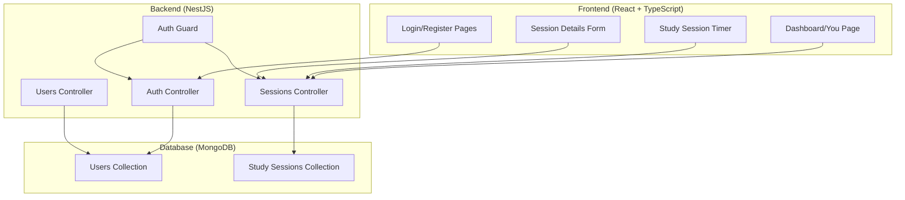

# Design Document

## Overview

The Study Tracker App is a full-stack web application built with React/TypeScript frontend, NestJS backend, and MongoDB database. The architecture follows a clean separation of concerns with a RESTful API design, and client-side timer functionality that updates the display every second during study sessions. The application emphasizes simplicity and user experience, drawing inspiration from Strava's session-based tracking model adapted for study activities.

## Architecture

### System Architecture



### Technology Stack

**Frontend:**
- React 18 with TypeScript for type safety and modern development
- Mantine UI v7 for consistent, accessible components
- React Router for client-side navigation
- Native fetch API for HTTP requests
- React Context for global state management (auth, session)

**Backend:**
- NestJS framework with TypeScript
- Simple session-based authentication with cookies
- Mongoose ODM for MongoDB integration
- Basic request validation

**Database:**
- MongoDB for flexible document storage
- Local MongoDB instance for simplest hackathon setup
- Indexed collections for performance


## Components and Interfaces

### Frontend Components

#### Authentication Components
- `LoginForm`: Email/password login with validation
- `RegisterForm`: User registration with email verification
- `ProtectedRoute`: Route protection component that redirects to login if not authenticated
- `AuthContext`: Global authentication state management

#### Study Session Components
- `StudyTimer`: Client-side timer that updates every second with start/pause/end controls
- `SessionForm`: Optional title/description input after session completion
- `SessionCard`: Individual session display component
- `SessionsList`: Paginated list of user's study sessions

#### Layout Components
- `AppShell`: Main application layout with navigation
- `Navigation`: Top/side navigation with user menu
- `Dashboard`: Main "You" page layout

### Backend Services and Controllers

#### Authentication Module
```typescript
interface AuthService {
  register(email: string, password: string): Promise<User>
  login(email: string, password: string): Promise<User>
  getCurrentUser(sessionId: string): Promise<User>
}

interface AuthController {
  POST /auth/register
  POST /auth/login
  GET /auth/profile (protected)
  POST /auth/logout
}
```

#### Study Sessions Module
```typescript
interface StudySessionService {
  createSession(userId: string): Promise<StudySession>
  updateSession(sessionId: string, updates: Partial<StudySession>): Promise<StudySession>
  endSession(sessionId: string, title?: string, description?: string): Promise<StudySession>
  getUserSessions(userId: string, page: number, limit: number): Promise<StudySession[]>
}

interface StudySessionController {
  POST /sessions/start (protected)
  PATCH /sessions/:id (protected)
  POST /sessions/:id/end (protected)
  GET /sessions (protected)
}
```

## Data Models

### User Model
```typescript
interface User {
  _id: ObjectId
  email: string
  password: string // hashed
  createdAt: Date
  updatedAt: Date
}
```

### Study Session Model
```typescript
interface StudySession {
  _id: ObjectId
  userId: ObjectId
  title: string // title should be required, if not user inputted put placeholder
  description?: string
  startTime: Date
  endTime?: Date
  duration: number // in milliseconds
  status: 'active' | 'paused' | 'completed'
  pausedDuration: number // total time paused
  createdAt: Date
  updatedAt: Date
}
```

### Database Indexes
- Users: `{ email: 1 }` (unique)
- StudySessions: `{ userId: 1, createdAt: -1 }` for efficient user session queries

## Error Handling

### Frontend Error Handling
- Global error boundary for React component errors
- Fetch API error handling with try-catch blocks
- Toast notifications for user-friendly error messages
- Basic form validation
- Simple network error handling

### Backend Error Handling
- Global exception filter for consistent error responses
- Basic request validation
- Simple error responses with appropriate HTTP status codes

```typescript
interface ErrorResponse {
  statusCode: number
  message: string | string[]
  error: string
  timestamp: string
  path: string
}
```

### Error Scenarios
- Authentication failures (401)
- Validation errors (400)
- Resource not found (404)
- Server errors (500)
- Network connectivity issues
- Session timeout handling

## Testing Strategy

### Frontend Testing
- Unit tests for utility functions and hooks using Jest
- Component testing with React Testing Library
- Integration tests for user flows (login, session creation)
- E2E tests for critical paths using Playwright

### Backend Testing
- Unit tests for services and controllers using Jest
- Integration tests for API endpoints
- Database integration tests with test database
- Authentication and authorization testing

### Test Coverage Goals
- Minimum 80% code coverage for critical business logic
- 100% coverage for authentication and session management
- Integration tests for all API endpoints
- E2E tests for complete user workflows

### Testing Environment
- Separate test database for isolation
- Mock external dependencies
- Automated testing in CI/CD pipeline
- Performance testing for session tracking accuracy